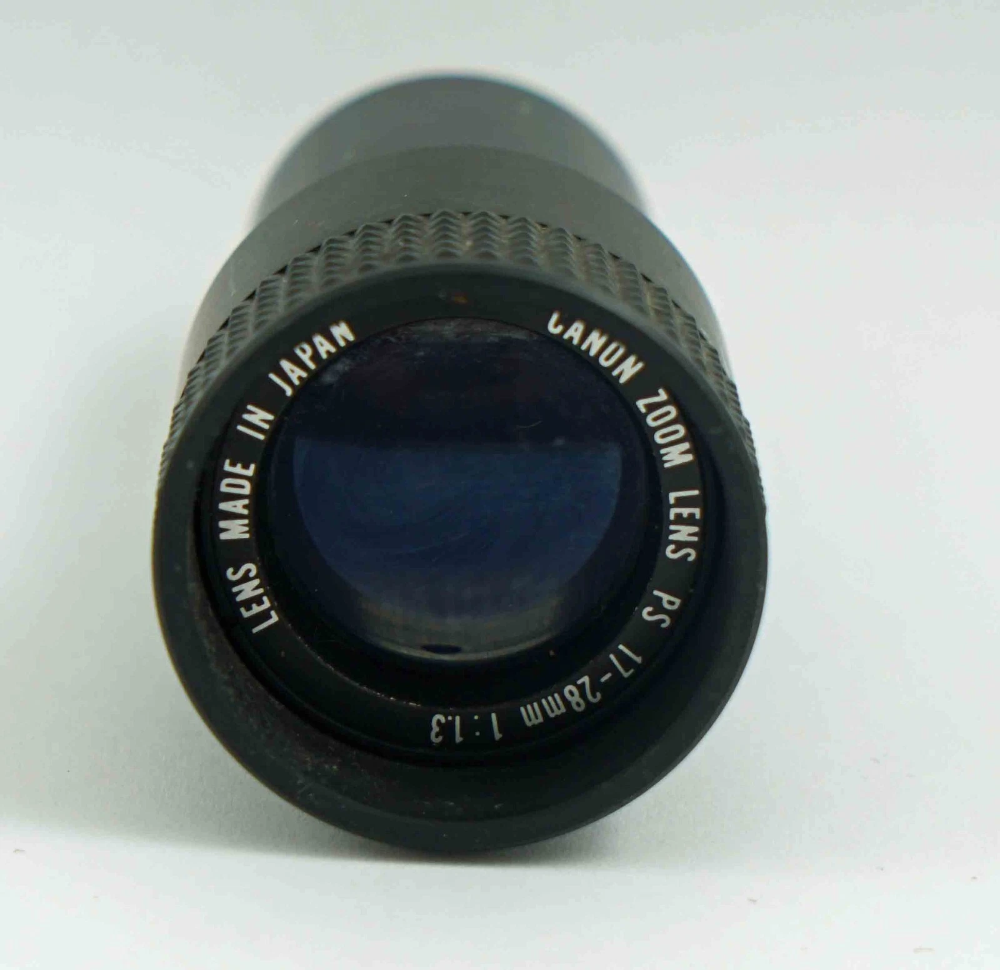
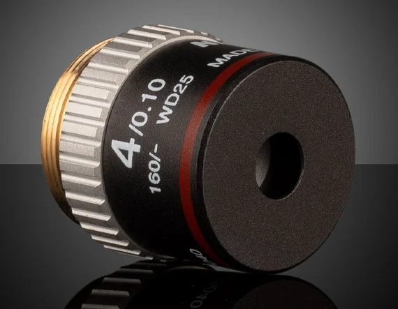
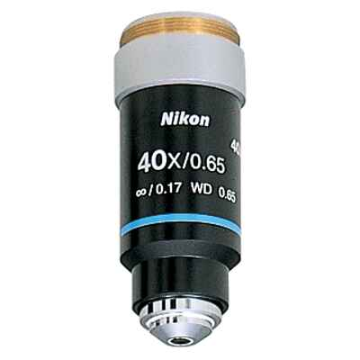

# 📸 Colección de lentes

| Foto | Cant | Marca / Modelo | Tipo de lente | Montura | Focal (mm) | Apertura (f) | Iris | Enfoque | Tamaño sensor | Distorsión | Peso | Largo | Uso original / Compatibilidad | Notas | Enlace | Sensor OK | Back focus | Adaptador | Resolución | Estado | Fecha | WD (mm) |
|---|---|---------------------|----------------|---------|-------------|---------------|------|----------|----------------|-------------|------|--------|-------------------------------|-------|--------|-----------|-------------|-----------|------------|--------|--------|---------|
|  | 1 | Hikrobot MVL-KF1628M-12MPE | Fijo industrial FA | C-Mount | 16 mm | f/2.8–f/16 | Manual | Manual | 1.1" (17.6 mm) | 0.15% | 189 g | 68.2 mm | Raspberry Pi HQ, cámaras FA | Muy nítido, metálico | [Aliexpress](https://es.aliexpress.com/item/1005006636017576.html?spm=a2g0o.order_list.order_list_main.62.21ef194dxy6fVy&gatewayAdapt=glo2esp) | ✔️ 12MP | ~17.5 mm | Ninguno | Hasta 16MP | Nuevo | 2024-11 | — |
|  | 1 | Canon Zoom PS 17–28mm 1:1.3 | Zoom cine 8mm | Ø30 mm (sin rosca) | 17–28 mm | f/1.3 | Fijo | Fijo | Cine 8mm | Media | 94 g | 72 mm | Canon PS-1000, S-400, P-777 | Requiere adaptación a C-mount | [Referencia](https://van-eck.net/en/product/objective-lens-canon-zoom-lens-ps-11-3-17-28mm-ls-0182-used/) | ❓ | ~40 mm* | Personalizado | ≤8MP | Usado | 2025-06 | — |
|  | 2 | Nikon 4X / 0.10 160/- WD25 (MSB50040) | Objetivo de microscopio | RMS (20.32 mm x 36 TPI) | ~30.97 mm (equiv.) | NA 0.10 | Fijo | Fijo | 2/3" máx. sensor | Muy baja / campo plano | ~80 g | ~30 mm | Microscopios DIN 160 mm tubo finito | Ideal para imagen macro de alta nitidez. Se puede adaptar a Raspberry Pi HQ con tubo RMS–C-mount. | [Referencia](https://www.edmundoptics.com/p/4x-nikon-achromatic-finite-conjugate-objective/16597/?srsltid=AfmBOorXFO_Ccriwttnf5qClhroa-4DDUiZN_hpId1ertr4G2dxhJUuD) | ✔️ (con adaptador) | 160 mm (óptico) | RMS a C-Mount | Muy alta en centro, plana | Usado | 2025-06 | 25.0 |
|  | 2 | Nikon BE Plan 40X / 0.65 ∞/0.17 (MRP00402) | Objetivo de microscopio | RMS (20.32 mm x 36 TPI) | ~4.5 mm (equiv.) | NA 0.65 | Fijo | Fijo | 2/3" máx. sensor | Muy baja / campo plano | ~80 g | ~45 mm | Microscopios CFI Infinito / Brightfield | Excelente para imagen macro de altísima resolución. Requiere sistema óptico con lente tubo para uso digital. | [Referencia](https://www.microscope.healthcare.nikon.com/products/objectives/educational-objectives/achro#achro40x) | ✔️ (con lente tubo) | Infinito óptico | RMS a sistema óptico | Muy alta en centro y bordes | Usado | 2025-06 | 0.65 |
